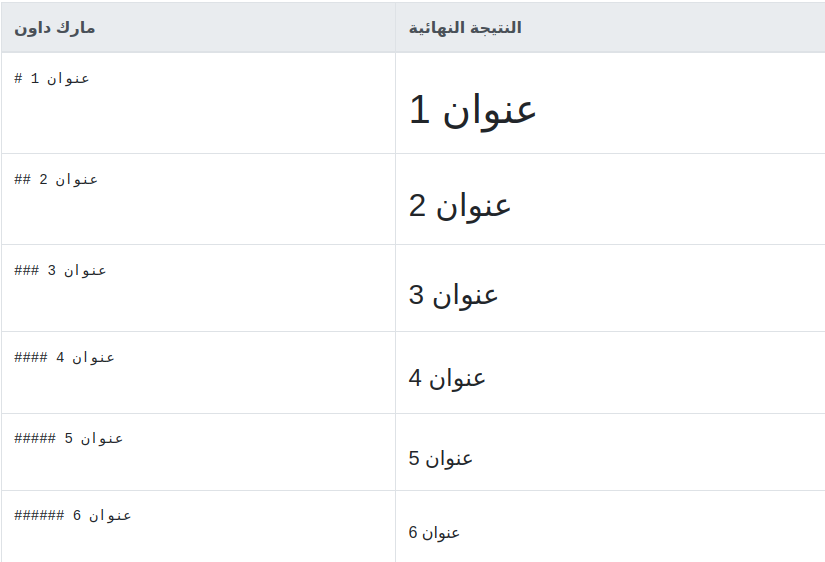

# العناوين :

يمكن كتابة عناوين ب6 مقاسات مختلفة عن طريق إستخدام رمز الشباك `#` حيث يكون العنوان الذي يٌستَخدم فيه شباك واحد `#` هو أكبر مقاس ممكن للعناوين و يُستَخدم غالبًا كعنوان لفصل في كتاب كبير يحتوي على عدة فصول , أما عند إستخدام شُباكين `##` فستحصل على عُنوان أصغر قليلاً من العُنوان الذي يَستَخدم شُباكً واحدًا وهكذا مع باقي العناوين وصولاً الى العنوان الذي يحتوي على ستة شبابيك `######` و الذي يُعد أصغر مقاس ممكن للعناوين .

### لاحظ أن :
1. ✅ كل ما هو على نفس السطر مع الشباك/الشبابيك يعد جزء من العنوان
2. ✅ يفضل ترك مسافة بين الشباك/الشبابيك و العنوان لأن *بعض* الأدوات التي تقوم بترجمة نصوص المارك داون الى صيغ أخرى تشترط وجود المسافة بين الشباك/الشبابيك و العنوان حتى تستطيع ترجمة العنوان بشكل صحيح 

### أمثلة :




# التأكيد :

للتأكيد على أهمية كلمة أو جملة ما في نص , يمكنك إما كتابتها بإستخدام **خط عريض** أو *خط مائل* أو ***خط مائل و عريض*** في نفس الوقت

لكتابة كلمة/جملة بخط مائل ضع نجمة `*` واحدة قبلها و أخرى بعدها 

مثال :

\* هذه الجملة مكتوبة بخط مائل \*     ========>    *هذه الجملة مكتوبة بخط مائل*


لكتابة كلمة/جملة بخط عريض ضع نجمتين `**` قبلها و نجمتين بعدها 

مثال :

\*\* هذه الجملة مكتوبة بخط عريض \*\*     ========>    **هذه الجملة مكتوبة بخط عريض**


لكتابة كلمة/جملة بخط مائل و عريض في نفس الوقت ضع ثلاث نجمات `***` قبلها و ثلاث نجمات بعدها 

مثال :

\*\*\* هذه الجملة مكتوبة بخط مائل و عريض \*\*\*     ========>    ***هذه الجملة مكتوبة بخط مائل و عريض***


# الإقتباس :

لتحديد سطر كإقتباس ضع قبله رمز ال"أكبر من"   `>` 

مثال :

`> هذا السطر عبارة عن إقتباس`

> هذا السطر عبارة عن إقتباس


يمكنك أن تكتب إقتباسًا متعدد الأسطر بشرط أن تبدأ كل سطر برمز ال"أكبر من"   `>`
مثال :

```
> هذا إقتباس متعدد الأسطر
> هذا هو السطر الثاني
> وهذا هو السطر الثالث
```
> هذا إقتباس متعدد الأسطر
> هذا هو السطر الثاني
> وهذا هو السطر الثالث


لاحظ أنه بالرغم من كون الثلاث أسطر في المثال السابق ظهرت كإقتباس واحد لكنها ظهرت جميعها على  
نفس السطر , إذا أردت أن تجعل كل سطر يظهر كما هو في الإقتباس دون ضم الأسطر الى بعضها في سطر واحد قم باضافة مسافتين الى نهاية كل سطر . 
عند التطبيق على المثال السابق يكون الناتج كالتالي
 
```
> هذا إقتباس متعدد الأسطر
> هذا هو السطر الثاني
> وهذا هو السطر الثالث
```
> هذا إقتباس متعدد الأسطر  
> هذا هو السطر الثاني  
> وهذا هو السطر الثالث


يمكنك أيضًا كتابة إقتباس داخل إقتباس آخر عن طريق إضافة رمز `>` آخر   
مثال:  


```
> هذا هو الإقتباس الرئيسي  
>> هذا إقتباس فرعي داخل الإقتباس الرئيسي
>>> هذا إقتباس ثالث داخل الإقتباس الفرعي
```

> هذا هو الإقتباس الرئيسي  
>> هذا إقتباس فرعي داخل الإقتباس الرئيسي
>>> هذا إقتباس ثالث داخل الإقتباس الفرعي  


❌ للأسف لا يمكنك وضع إقتباس فرعي في منتصف إقتباس آخر , عندها سيتم إعتبار الجزء المتبقي من الإقتباس الرئيسي تكملة للإقتباس الفرعي  

مثال :  

```
> هذا هو الإقتباس الرئيسي  
>> هذا إقتباس فرعي داخل الإقتباس الرئيسي
> هذه تكملة للإقتباس الرئيسي
```

> هذا هو الإقتباس الرئيسي  
>> هذا إقتباس فرعي داخل الإقتباس الرئيسي
> هذه تكملة للإقتباس الرئيسي 

اذا أردت أن تفصل بين نصين داخل نفس الإقتباس بسطر فارغ من دون أن تقسم الإقتباس  
إلى إقتباسين منفصلين ضع رمز `>` في بداية ذالك السطر الفارغ  

مثال :

~~~
> هذا هو الجزء الأول من الإقتباس   
>
> هذا هو الجزء الثاني من الإقتباس
>
> هذا هو الجزء الثالث من الإقتباس 
~~~

> هذا هو الجزء الأول من الإقتباس   
>
> هذا هو الجزء الثاني من الإقتباس
>
> هذا هو الجزء الثالث من الإقتباس  


أما عند عدم وجود رمز `>` في بداية السطر الفارغ فسوف يقوم السطر الفارغ بقسمة الإقتباس إلى إقتباسين منفصلين.

مثال :  

~~~
> هذا هو الجزء الأول من الإقتباس   

> هذا هو الجزء الثاني من الإقتباس

> هذا هو الجزء الثالث من الإقتباس 
~~~

> هذا هو الجزء الأول من الإقتباس   

> هذا هو الجزء الثاني من الإقتباس

> هذا هو الجزء الثالث من الإقتباس  


# الخطوط العرضية :

لرسم خط عرضي رفيع يفصل ما يسبقه عن ما يأتي بعده من محتوى الصفحة يمكنك أن تقوم بإحدي هذه الثلاث :

1. قم بوضع ثلاث شرطات علوية `-` متتالية أو أكثر على سطر بمفردها
2. قم بوضع ثلاث شرطات سفلية `_` متتالية أو أكثر على سطر بمفردها
3. قم بوضع ثلاث نجوم `*` متتالية أو أكثر على سطر بمفردها

مثال :  

```
هذا خط عرضي رسم بواسطة ثلاث شرطات علوية `-` متتالية  

---

هذا خط عرضي رسم بواسطة ثلاث شرطات سفلية `_` متتالية
  
___  
  
هذا خط عرضي رسم بواسطة ثلاث نجوم `*` متتالية  

***

```
  


هذا خط عرضي رسم بواسطة ثلاث شرطات علوية `-` متتالية  

---

هذا خط عرضي رسم بواسطة ثلاث شرطات سفلية `_` متتالية
  
___  
  
هذا خط عرضي رسم بواسطة ثلاث نجوم `*` متتالية  

***


✅ لاحظ أن النتيجة واحدة سواءً إستخدمت النجمة أو الشرطة العلوية أو السفلية  
✅ من الأفضل ترك سطر فارغ قبل الخط العرضي و آخر بعده


